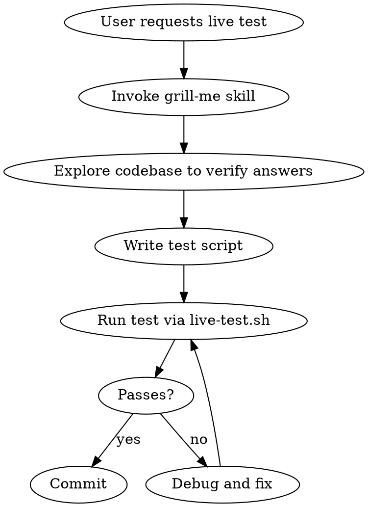

# Creating Live Tests

Create end-to-end bash test scripts for the Redtrail CLI that live in `eval/tests/` and are executed by both `scripts/live-test.sh` (dev feedback) and `eval/score.sh` (eval loop).

## Hard Gate

**Before writing ANY test code, you MUST use the Skill tool to invoke the `grill-me` skill.**

This is not optional. This is not "grill them yourself." You MUST call:
```
Skill(skill: "grill-me")
```

The grill-me skill will guide you through interviewing the user. Feed it these specific areas to probe:
- What exactly the command does and what "working" means
- What data setup is required (and whether the command even exists yet)
- What assertions actually prove correctness vs just "something happened"
- Edge cases and failure modes worth testing
- Whether LLM involvement makes the test non-deterministic (`.llm.sh`)

Do NOT skip grilling because "the test is simple" or "the pattern is obvious."

| Rationalization | Reality |
|---|---|
| "I can ask the questions myself" | The grill-me skill is relentless. You are not. Invoke it. |
| "The test pattern is obvious" | The baseline agent assumed output format, headings, and flags. All wrong. |
| "I'll just check the codebase" | Codebase tells you what IS, not what SHOULD BE. Grill first. |
| "This is a simple test" | Simple tests have the most hidden assumptions. Grill harder. |

**After grilling:** explore the codebase to verify assumptions before implementing.

## Process



## Grilling Checklist

These questions MUST be resolved (by asking or by exploring the codebase) before writing:

1. **Does the command exist?** — `grep` for it in `src/cli/`. If not, the test is specifying behavior for something unbuilt.
2. **What is the exact CLI invocation?** — Flags, subcommands, output format (`--json`?).
3. **What data does it need?** — Which tables need rows? Can we use `rt sql` to insert, or does setup require other commands?
4. **What does success look like?** — Exact strings/patterns to grep for. Not guesses — read the source.
5. **Is it deterministic?** — If LLM is involved, name it `.llm.sh`. If not, `.sh`.
6. **What can go wrong?** — Timeout? Empty output? Partial data? Test what matters.

## Test Script Template

```bash
#!/usr/bin/env bash
set -euo pipefail

REPO_ROOT="$(cd "$(dirname "$0")/../.." && pwd)"
if [[ -n "${RT_BIN:-}" ]]; then
    RT="$RT_BIN"
else
    cargo build --release --manifest-path "$REPO_ROOT/Cargo.toml" 2>/dev/null
    RT="$REPO_ROOT/target/release/rt"
fi

# Isolate: override HOME so ~/.redtrail/ goes to a temp dir
ORIG_HOME="$HOME"
TMPDIR=$(mktemp -d)
trap 'export HOME="$ORIG_HOME"; rm -rf "$TMPDIR"' EXIT
export HOME="$TMPDIR"
cd "$TMPDIR"

# Setup workspace
"$RT" init --target <TARGET_IP> 2>/dev/null 1>/dev/null

# <Data setup — use rt sql or other commands>

# <Test: run command, capture output>

# <Assertions — grep for specific expected content>

echo "PASS"
```

## Naming Convention

- `eval/tests/feature-<name>.sh` — deterministic test
- `eval/tests/feature-<name>.llm.sh` — involves LLM calls (gets majority vote: 3 runs, pass if 2/3)

## Running

```bash
./scripts/live-test.sh <name>        # run just this test
./scripts/live-test.sh               # run all tests
./scripts/live-test.sh --fix <name>  # Claude fixes if failing
```

## Common Mistakes

| Mistake | Fix |
|---------|-----|
| Assuming command output format without checking source | Read the actual handler in `src/cli/` first |
| Testing existence instead of correctness | Don't just check file exists — verify content |
| Inserting data without session_id | Get active session ID via `rt sql --json` first |
| Forgetting `2>/dev/null` on rt commands | Suppress stderr to keep test output clean |
| Not using `$RT_BIN` contract | Always use the if/else pattern from the template |
