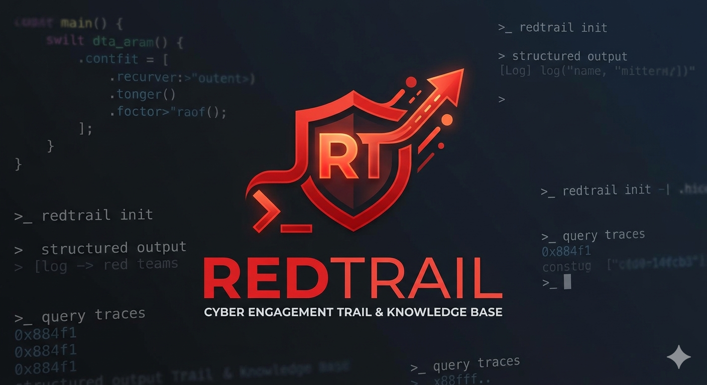

<p align="center">
  
</p>

# RedTrail

You fixed that nasty bug last month. You know you did. But you can't remember what you ran, what the output was, or which Claude Code session actually led to the fix. So you spend 40 minutes having Claude rediscover the solution from scratch. RedTrail helps you capture that context, forever. And so does a regresion test :)

RedTrail is a terminal intelligence engine that transparently captures everything that happens in your shell — whether typed by a human or executed by an AI agent — structures it into queryable knowledge, and surfaces actionable insights.

No new syntax. No workflow change. Your shell stays your shell. RedTrail installs as shell hooks (zsh/bash) and silently records every command, its output, exit code, timing, and context. You never lose track of what happened.

```bash
eval "$(redtrail init zsh)"   # add to .zshrc — that's it
# ... work normally ...
redtrail history               # what did I run?
redtrail history --failed      # what broke?
redtrail history --search ssl  # find that openssl command from yesterday
redtrail resolve "connection refused"  # seen this error before?
```

---

## Why

Developers and AI agents run hundreds of commands a day across
terminals, sessions, and tools. Context evaporates:

- **Agent blind spots.** AI coding agents (Claude Code, Cursor, Codex)
  execute commands but have no memory across sessions. Each conversation
  starts cold. You can't even see what they did.
- **Repeated debugging.** You hit the same error last week, fixed it,
  and forgot how.
- **Context switching.** You step away and come back with zero context
  on what you were doing.
- **Lost history.** Terminal scrollback is not a knowledge base. You ran
  that command yesterday but can't find it.
- **No output recall.** You remember the command but not what it printed.

RedTrail fixes this by capturing, storing, and structuring your terminal
activity — so you (and your agents) can query it later.---

## How RedTrail Compares

| Feature                        | RedTrail | atuin | shell history |
| ------------------------------ | -------- | ----- | ------------- |
| Command capture                | ✓        | ✓     | ✓             |
| Output capture (stdout/stderr) | ✓        | ✗     | ✗             |
| AI agent awareness             | ✓        | ✗     | ✗             |
| Error resolution lookup        | ✓        | ✗     | ✗             |
| Agent session reports          | ✓        | ✗     | ✗             |
| Context export for AI agents   | ✓        | ✗     | ✗             |
| Secret redaction               | ✓        | ✗     | ✗             |
| Full-text search on output     | ✓        | ✗     | ✗             |
| Cloud sync                     | ✗        | ✓     | ✗             |

## What It Does (Phase 1: Silent Capture — Complete)

### Capture

- **Shell hooks** — zsh and bash `preexec`/`precmd` hooks capture commands transparently. Zero behavior change.
- **Full capture** — command text, stdout, stderr, exit code, timestamps, working directory, git repo/branch, hostname, shell.
- **Streaming output** — stdout/stderr are streamed to the database every 1 second via a PTY-based tee process. Long-running commands (servers, watchers, builds) have their output visible in the database while still running.
- **Agent-aware** — detects whether commands come from a human or an AI agent (Claude Code, Cursor, etc.) and tags them with source metadata.
- **Claude Code integration** — `redtrail setup-hooks` installs hooks that capture agent tool events (Bash, Edit, Write, Read) directly.

### Security

- **Secret redaction** — secrets (API keys, tokens, passwords, PEM keys, connection strings) are detected and redacted _before_ data touches the database. Runs on every streaming flush and again as a final pass on command completion.
- **Configurable modes** — `on_detect: redact` (default) replaces secrets with `[REDACTED:label]`. `on_detect: block` deletes the entire command row. `on_detect: warn` stores unredacted but flags detection.
- **Custom patterns** — define your own secret patterns via a YAML file for proprietary token formats.
- **Redaction audit log** — every redaction event is logged with the field, pattern label, and timestamp.
- **Owner-only permissions** — database file is locked to 600 on creation.

### Storage

- **SQLite with WAL mode** — single local database file, concurrent-read safe.
- **FTS5 full-text search** — search across commands and output.
- **Streaming status** — commands have `status='running'` while executing, `status='finished'` on completion, `status='orphaned'` for stale processes.
- **Compression** — large stdout/stderr is zlib-compressed at finalization.
- **Retention** — configurable automatic cleanup of old data.

### CLI

- **History** — browsing with filters: failed, command, cwd, source, tool, search, today, verbose, json.
- **Sessions** — list and inspect terminal sessions.
- **Error resolution** — `redtrail resolve` looks up an error message and finds past fixes from history.
- **Agent context** — `redtrail agent-context` generates a context document for a new AI agent session.
- **Agent reports** — `redtrail agent-report` summarizes AI agent activity.
- **Data control** — `forget` deletes data by command, session, or time range. `export` dumps as JSON.
- **Raw queries** — `redtrail query "SELECT ..."` for ad-hoc read-only SQL.
- **Configuration** — YAML config at `~/.config/redtrail/config.yaml`, manageable via `redtrail config`.

---

## Quick Start

### 1. Install

Requires [Rust](https://www.rust-lang.org/tools/install) (1.85+).

```bash
git clone https://github.com/adriangonzalez/redtrail.git
cd redtrail
cargo install --path .
```

### 2. Activate shell hooks

Add to your `~/.zshrc` (or `~/.bashrc`):

```bash
eval "$(redtrail init zsh)"    # or: eval "$(redtrail init bash)"
```

Open a new terminal. That's it — RedTrail is now capturing.

### 3. (Optional) Set up agent capture

If you use Claude Code:

```bash
redtrail setup-hooks
```

This installs hooks so that agent-executed commands are captured with full tool metadata.

### 4. Use it

```bash
redtrail history                          # recent commands
redtrail history --failed                 # commands that failed
redtrail history --cmd git                # only git commands
redtrail history --cwd .                  # commands run in this directory
redtrail history --search "connection refused"  # full-text search
redtrail history --source claude_code     # only agent commands
redtrail history --verbose                # include stdout/stderr
redtrail history --json                   # JSON output

redtrail sessions                         # list sessions
redtrail session <id>                     # commands in a session
redtrail status                           # database stats

redtrail resolve "error: ECONNREFUSED"    # find past fixes
redtrail agent-context                    # context doc for AI agents
redtrail agent-report --last 2h           # agent activity summary

redtrail forget --last 1h                 # delete last hour
redtrail forget --command <id>            # delete specific command
redtrail forget --session <id>            # delete entire session

redtrail export --since 7d               # export as JSON
redtrail query "SELECT * FROM commands WHERE exit_code != 0 LIMIT 10"
```

---

## Architecture

```
┌──────────────────────────┐  ┌───────────────────────────────┐
│      USER'S SHELL        │  │       AI AGENTS               │
│  preexec/precmd hooks    │  │  Claude Code · Cursor · Codex │
│  zero behavior change    │  │  hooks capture tool events    │
└────────────┬─────────────┘  └───────────────┬───────────────┘
             │                                │
             ▼                                ▼
┌─────────────────────────────────────────────────────────────┐
│                     CAPTURE LAYER                           │
│  capture start → tee (PTY relay + 1s DB flush) → finish    │
│  command parsing · secret redaction · agent detection       │
└──────────────────────────┬──────────────────────────────────┘
                           │
                           ▼
┌─────────────────────────────────────────────────────────────┐
│                   SQLITE DATABASE (WAL mode)                │
│   commands · sessions · redaction_log · FTS5 search         │
│   600 permissions · local only · single file                │
└──────────────────────────┬──────────────────────────────────┘
                           │
                           ▼
┌─────────────────────────────────────────────────────────────┐
│                        CLI                                  │
│  history · sessions · status · forget · query · export      │
│  resolve · agent-context · agent-report · config            │
└─────────────────────────────────────────────────────────────┘
```

### Capture Lifecycle

Every command goes through a three-stage lifecycle:

1. **`capture start`** (preexec) — inserts a `status='running'` row, returns a command ID. Runs synchronously (<15ms).
2. **`redtrail tee`** (background) — PTY relay process. Reads command output from PTY masters, writes to `/dev/tty` (terminal) and flushes to the database every 1 second with secret redaction applied.
3. **`capture finish`** (precmd, backgrounded) — sets exit code, timestamp, status='finished'. Runs a final defense-in-depth redaction pass, syncs the FTS index, and compresses large output.

This design means long-running commands (web servers, watchers, log tailers) have their output visible in the database while still executing — not just after termination.

---

## Configuration

```yaml
# ~/.config/redtrail/config.yaml
capture:
  enabled: true
  blacklist_commands: [vim, nvim, nano, ssh, top, htop, less, more, man]
  max_stdout_bytes: 524288 # 512KB per command
  retention_days: 90

secrets:
  on_detect: redact # redact | block | warn
  patterns_file: null # path to custom patterns YAML
```

---

## Design Principles

1. **Zero friction.** Source one line in your shell config. No prefixes, no wrappers, no behavior change.
2. **Silence by default.** RedTrail never prints to your terminal during normal use. Invisible until you query it.
3. **Privacy first.** All data is local. Nothing leaves the machine. Secrets are redacted before storage. Database permissions are locked to owner-only.
4. **Performance.** Shell hooks add <50ms. Database writes are async. The tool must never make your terminal feel sluggish.
5. **Graceful degradation.** Every layer works independently. If the database is locked, output still flows to your terminal. If capture start fails, the command runs normally.
6. **Agent-aware.** AI agents are first-class citizens. Their commands are captured with the same fidelity as human-typed ones.

---

## Testing

RedTrail has a comprehensive live test suite that runs each test in an isolated Docker container with real shell hooks, PTY capture, and database verification.

```bash
make test-live              # run all 36 live tests
make test-live --fast       # skip LLM-dependent tests
cargo test                  # run unit tests
```

---

### Coming Next

- **Phase 2:** Intelligent extraction — structured entities from command output
- **Phase 3:** Git safety — catch secrets and mistakes before you push
- **Phase 4+:** Background pattern mining, autonomous improvement loops, MCP integration---

---

## Status

Absolute early days. I envision RedTrail in phases, and this barely finishes Phase 1, so
expect really rough edges, bugs, and missing features. Working really hard on solving the context problem for terminal
users and agents - if that resonates, follow along and share feedback!

---

## Contributing

Probably not the best time to contribute with code because my lack of time to fully interact with community, but feedback, ideas, suggestions, and, if you need to express the feature with code, then a PR, are all very welcome.

- **Issues** — bug reports, feature requests, workflow suggestions

---

## License

This project is licensed under the [MIT License](LICENSE).

---

<p align="center">
  <em>Your AI agent forgets everything. RedTrail doesn't.</em>
</p>
