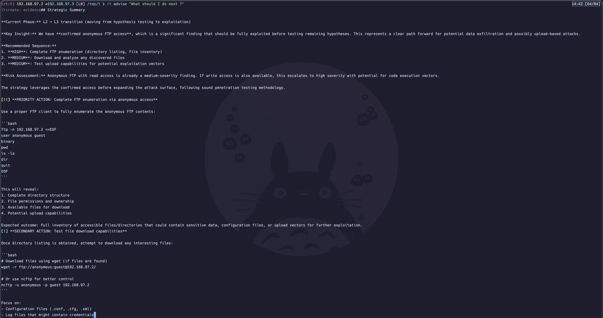

# RedTrail

**Your terminal has memory now**. Bring a searchable brain to your pentest engagements.

RedTrail wraps your terminal.
**No new syntax to learn. No workflow to change. Your shell stays your shell.**
Every command you run — nmap, ffuf, gobuster, sqlmap — gets captured, stored, and made queryable.
Your engagement builds a persistent trail of findings, hypotheses, and evidence. You never lose context again.

The CLI command is `rt` (short for "RedTrail")

```bash
$ rt init --target 10.10.10.1
$ eval "$(rt env)"       # It generate aliases for your tools, for example, `nmap` becomes `rt nmap`.
(rt:htb-machine) 10.10.0.1 <-> 10.10.0.2 L0 $ nmap -sV 10.10.10.1           # captured, parsed, stored
(rt:htb-machine) 10.10.0.1 <-> 10.10.0.2 L0 $ kb ports                      # what did we find?
(rt:htb-machine) 10.10.0.1 <-> 10.10.0.2 L0 $ ask "what should I try next?" # AI assistant gives suggestions based on current findings
```

---

## Why

Pentesting is messy. You run 40 commands across 3 terminals, switch between targets, lose track of what you already tried, and forget that one credential you found two hours ago.

Sound familiar?

- **Lost context.** You found SSH creds earlier but forgot which host they were for.
- **No history.** Terminal scrollback is not a knowledge base.
- **Repeated work.** You re-run scans because you can't remember if you already checked that port.
- **Reporting pain.** Reconstructing what you did from bash history is brutal.
- **Context switching.** You step away for lunch and come back cold.

RedTrail fixes this by sitting between you and your tools. It watches, records, organizes and suggests — so you can focus on thinking, not bookkeeping.

Example of AI-assisted reasoning:



---

## Why Now

LLMs made it possible to turn raw command output into structured data without writing custom parsers for each tool. RedTrail builds on that
to make your terminal workflow queryable and persistent.

---

## What It Does

- **Transparent proxy** — aliases wrap your tools (nmap, ffuf, gobuster, etc.). Commands run normally, but input and output are captured.
- **Structured knowledge base** — hosts, ports, credentials, flags, web paths, and vulnerabilities are extracted and stored in a local SQLite database.
- **Auto-extraction** — AI parses command output and populates the KB with structured findings. No manual data entry.
- **Hypothesis tracking** — form hypotheses ("SSH might have weak creds"), link evidence, update status as you test them.
- **Session management** — multiple sessions per workspace. Switch between them, export, resume later.
- **Scope enforcement** — define allowed CIDRs, get warned when a command targets something out of scope.
- **Flag detection** — auto-captures CTF flags from command output using configurable patterns.
- **Noise budgeting** — tracks how "loud" your engagement is based on tool aggressiveness.
- **AI assistant** — ask questions about your findings, get suggestions for next steps based on what you've already discovered.
- **Report generation** — synthesize your trail into a structured engagement report.

---

## Quick Start

### 1. Install

```bash
cargo install --path .
```

### 2. Set up

```bash
rt setup                    # interactive wizard — checks prerequisites, configures LLM provider
```

### 3. Start an engagement

```bash
mkdir ~/pentests/target && cd ~/pentests/target
rt init --target 10.10.10.1 --scope 10.10.10.0/24 --goal capture-flags
eval "$(rt env)"            # activates shell aliases
```

### 4. Work normally

```bash
nmap -sV $TARGET            # proxied — output captured and extracted
gobuster dir -u http://$TARGET -w /usr/share/wordlists/common.txt
curl -s http://$TARGET/robots.txt
```

### 5. Query your findings

```bash
rt kb hosts                 # discovered hosts
rt kb ports --host 10.10.10.1   # open ports on target
rt kb creds                 # any credentials found
rt status                   # engagement overview
```

### 6. Get suggestions

```bash
rt ask "what services look interesting?"
rt ask "I have SSH creds, what should I try?"
```

### 7. Track your reasoning

```bash
rt hypothesis create "FTP allows anonymous login" --confidence 0.6
rt evidence add 1 "vsftpd 3.0.3 — known to allow anon by default"
rt hypothesis update 1 --status confirmed
```

### 8. Clean up

```bash
rt deactivate               # removes aliases from current shell
rt report generate          # generate engagement report
rt session export           # export session data
```

---

## Core Concepts

### Workspace

Any directory where you run `rt init`. RedTrail links the directory to a session in its global database — no files are created in your project folder. Think of it like a Python virtualenv — scoped to a directory, activated per shell session.

All data lives in a single global database at `~/.redtrail/redtrail.db`. Configuration is also stored in the database, managed via `rt config` commands.

### Session

An engagement context tied to a workspace directory. Tracks target, scope, goal, phase, and noise budget. You can have multiple sessions per directory — useful for retesting or separating approaches. One session is active per workspace at a time.

### Knowledge Base

The structured store of everything discovered: hosts, ports, services, credentials, flags, web paths, access levels, vulnerabilities, notes. Populated automatically by the extraction agent or manually via `rt kb add-*` commands. Queryable with `rt kb <type>` or directly via SQLite.

Its the searchable "memory" of your engagements.

### Trail

The full record of your engagement: every command run, every finding extracted, every hypothesis formed, every piece of evidence collected. This is what makes your workflow reproducible and reportable.

### Phase

RedTrail tracks engagement progress automatically:

| Phase                       | Meaning                                     |
| --------------------------- | ------------------------------------------- |
| **L0 — Setup**              | Workspace initialized, no enumeration yet   |
| **L1 — Surface Mapped**     | Hosts discovered, attack surface visible    |
| **L2 — Hypotheses Pending** | Hypotheses formed, waiting to be tested     |
| **L3 — Confirmed**          | Vulnerabilities confirmed, ready to exploit |

Phase advances automatically based on your knowledge base state.

Is the brain, the methodology. Internally, I call it the strategist

---

## The AI Feature

RedTrail includes an AI assistant that reads your knowledge base and provides contextual suggestions. It's useful. It's also optional.

### What it does

- **Extraction** — after each command, an AI agent parses the output and writes structured records to the KB. This is the main quality-of-life feature. You run nmap, and the hosts/ports/services appear in `rt kb` without you doing anything.
- **Ask** — `rt ask "question"` gives you a conversational interface over your findings. It knows what you've discovered, what hypotheses are open, and what phase you're in.
- **Strategic advice** — the assistant can suggest next steps based on a structured methodology (reconnaissance → hypothesis → testing → exploitation).

### What it doesn't do

- It doesn't run commands for you, but lets you decide.
- It doesn't make decisions for you, but keeps your methodology.
- It doesn't replace knowing what you're doing, there is no way around this.

## Philosophy

RedTrail is a **human-in-the-loop** tool. Always.

The human decides what to run. The human interprets the results. The human chooses the attack path. RedTrail handles the tedious parts — recording, organizing, and recalling — so you can focus on the parts that require judgment. You have ideas, the assistant suggests tools approve or reject them.

We believe:

- **Tools should augment, not replace.** A pentester's intuition is irreplaceable. RedTrail gives it better inputs.
- **Context is king.** The difference between a junior and senior pentester isn't what tools they know — it's how well they connect findings across an engagement. RedTrail makes those connections visible.
- **Transparency matters.** Everything RedTrail stores is in a local SQLite file you own. No cloud. No telemetry. No magic.

---

## Use Cases

### CTF Competitions

Init a workspace per challenge. Auto-capture flags. Never lose track of which ports you already scanned. Export your trail for writeups.

```bash
rt init --target 10.10.10.1 --goal ctf
eval "$(rt env)"
# ... hack away ...
rt kb flags               # what did we capture?
```

### Client Engagements

Scope enforcement keeps you honest. Hypothesis tracking gives you a structured methodology. Report generation saves hours of post-engagement documentation.

```bash
rt init --target 192.168.1.0/24 --scope 192.168.1.0/24 --goal general
```

### Bug Bounty

Track findings across sessions. Come back to a target days later and pick up exactly where you left off. The knowledge base remembers what you don't.

### Learning & Practice

Review your command history to understand what worked and why. The structured trail is a better learning tool than raw terminal output.

---

## Installation

### From source (recommended for now)

Requires [Rust](https://www.rust-lang.org/tools/install) (1.85+).

```bash
git clone https://github.com/your-org/redtrail.git
cd redtrail
cargo install --path .
```

The binary `rt` will be installed to `~/.cargo/bin/`. Make sure it's in your PATH.

### Prerequisites

- An LLM API key (Anthropic, OpenAI, or compatible) for AI features
- Standard pentesting tools (nmap, gobuster, ffuf, etc.) — RedTrail wraps them, doesn't replace them

### First run

```bash
rt setup                    # walks you through configuration
```

This sets up your global config and verifies prerequisites.

---

## Roadmap

RedTrail is under active development. Here's what's on the horizon:

- [ ] Plugin ecosystem for community skills
- [ ] Multi-target campaign management
- [ ] Collaboration features for team engagements
- [ ] Richer reporting templates
- [ ] Shell completions (bash, zsh, fish)
- [ ] Package distribution (Homebrew, AUR, etc.)

---

## Status

**RedTrail is early-stage software (v0.1.0)** and experimental, expect rough edges, specially around AI features. APIs and storage formats may change between versions. Back up your `.redtrail/` directories if your data matters. Right now, there is no anonymization
or encryption — all data is stored in plaintext in a local SQLite file.
**Do not use this on sensitive engagements until security features are implemented**.
**There is no sanitization of data ingested by the AI agent** so prompt injection is possible if you run on targets you are not aware of. I recommend
on CTF machines or lab environments until this is addressed.
I change the features frequently while I find the sweet spot, so expect some instability. The core command capture and storage is stable, but the AI extraction and assistant features are in active experimentation.

We're building in the open because we think the idea is useful and want feedback from real pentesters.

---

## Contributing

We are not allowing for code contributions just yet, but, issues and feedback is really useful. If you're a pentester who's tired of losing context or taking notes, or having a checklist with your methodology, we'd especially love your input on methodology and workflow.

- **Issues** — bug reports, feature requests, workflow suggestions
- **Skills** — write and share methodology modules

Please open an issue commenting on what you like, what you don't, and what you'd like to see. The best way to contribute right now is to use it and tell us how it fits (or doesn't fit) into your workflow.

---

## License

This project is not yet licensed. A license will be added before the first public release. If you have preferences, open an issue.

---

<p align="center">
<em>Built for people who hack in terminals.</em>
</p>
